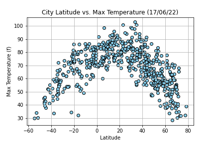
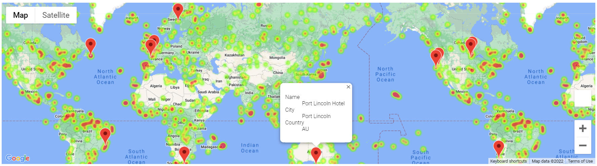

# Part 1: WeatherPy

## Aim

To prove that the weather is hotter as we approach the equator.

## Method

- Generate a list of cities across the world with varying fistance from the equator randomly using numpy and citypy
- Check the weather of the cities in the list using openWeatherMap API
- Create scatter plots for the following:
    - Temperature (F) vs. Latitude
    - Humidity (%) vs. Latitude
    - Cloudiness (%) vs. Latitude
    - Wind Speed (mph) vs. Latitude
- Create linear regression for the following:
    - Northern Hemisphere - Temperature (F) vs. Latitude
    - Southern Hemisphere - Temperature (F) vs. Latitude
    - Northern Hemisphere - Humidity (%) vs. Latitude
    - Southern Hemisphere - Humidity (%) vs. Latitude
    - Northern Hemisphere - Cloudiness (%) vs. Latitude
    - Southern Hemisphere - Cloudiness (%) vs. Latitude
    - Northern Hemisphere - Wind Speed (mph) vs. Latitude
    - Southern Hemisphere - Wind Speed (mph) vs. Latitude

## Findings

- There is strong relationship between latitude vs. temperature, r-value for latitude in Northern Hemisphere vs. temperature is less than -0.7, r-value for latitude in Southern Hemisphere vs. temperature is more than 0.7
- The weather is warmer when the latitude is closer to 0
- There is no relationship between latitude vs. humidity, r-values are close to 0
- There is no relationship between latitude vs. cloudiness, r-values are close to 0
- There is no relationship between latitude vs. wind speed, r-values are close to 0
- The above observations are based on weather data downloaded on 17 June 2022

## Graph - latitude vs. temperature

 

# Part 2: VacationPy

## Aim

Use weather data in planning for vacation.

## Method

- Create a heat map that displays the humidity for every city from the part 1
- Select cities for vacation by specifying weather condition preferences
- Use Google API to find hotels
- Plot the hotels on top of the humidity heatmap with each marker containing the Hotel Name, City, and Country.

## Heat map with hotel marker

 
